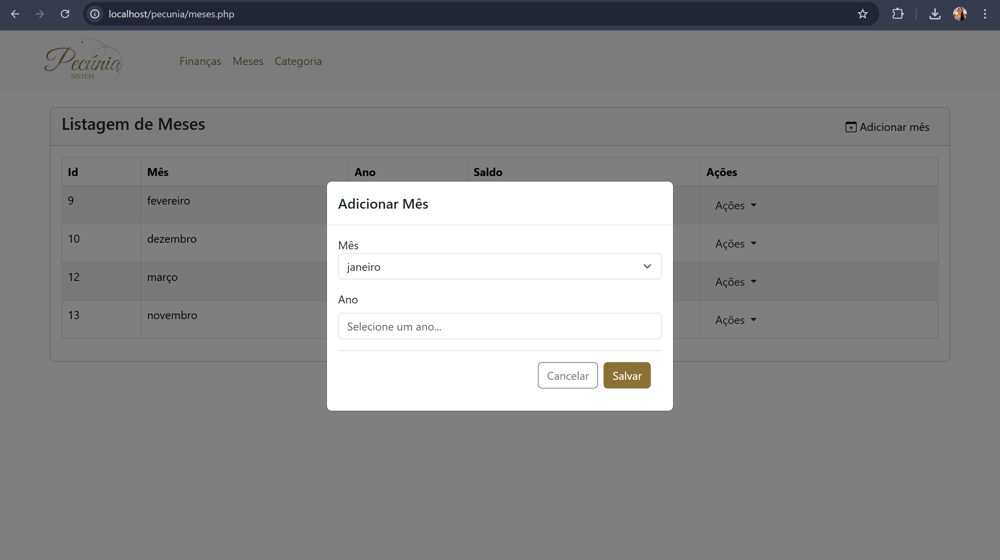
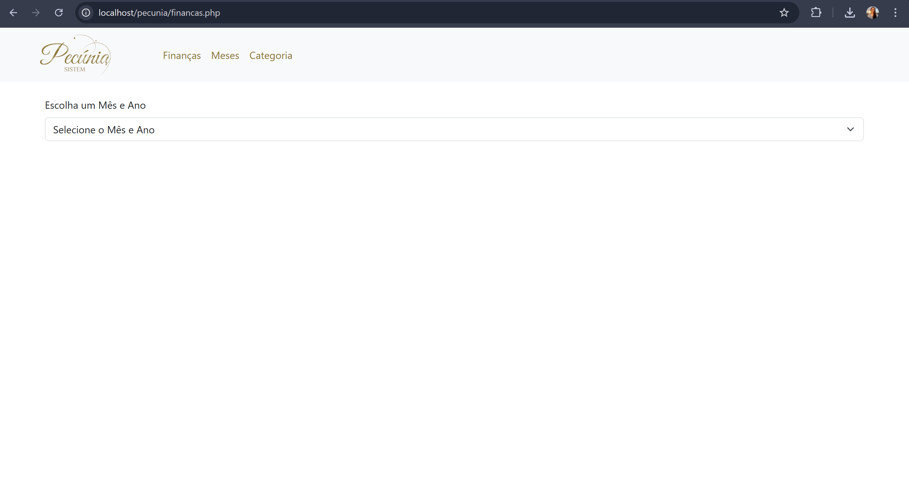

# Pecúnia Sistem - Sistema de Controle de Finanças  

**Descrição Geral**  
Bem-vindo ao Pecúnia Sistem, um sistema desenvolvido com o objetivo de proporcionar organização, transparência e eficiência na gestão financeira pessoal. Nossa aplicação permite aos usuários gerenciar suas finanças mensais de forma simples e prática, oferecendo recursos avançados para o controle de receitas, despesas e categorias financeiras.  

A **Pecúnia Sistem**, uma empresa reconhecida pela seriedade e excelência no desenvolvimento de soluções financeiras, apresenta este sistema como uma ferramenta essencial para auxiliar na tomada de decisões financeiras informadas.  

---

## Funcionalidades  
### 1. **Index**

### 2. **Tela de Visão Geral dos Meses**  
- Apresenta a listagem de todos os meses cadastrados no sistema.  
- Exibe o saldo final de cada mês, destacado em cores para facilitar a interpretação:  
  - **Verde**: Saldo positivo.  
  - **Vermelho**: Saldo negativo.  
  - **Amarelo**: Saldo neutro.
 
  
  
  
  
  
### 3. **Tela de Finanças Mensais**  
- Permite selecionar o mês e o ano desejado por meio de um dropdown.  
- Exibe as seguintes informações detalhadas:  
  - Saldo final do mês.  
  - Quantidade de entradas e seu valor total.  
  - Quantidade de saídas e seu valor total.  
- Acompanhamento dinâmico das movimentações financeiras.

  
  
  
  
  
  
    

### 4. **Tela de Categorias**  
- Gerencie as categorias de despesas e receitas.  
- Funções disponíveis:  
  - Visualizar, cadastrar, editar e excluir categorias personalizadas.
  
  
  
  
  

---

## Tecnologias Utilizadas  

### **Frontend**  
- **HTML5**, **CSS3**, **Bootstrap**: Garantem uma interface amigável, responsiva e visualmente atrativa.  
- **JavaScript**: Proporciona interatividade e atualizações em tempo real na interface do sistema.
- **Biblioteca jQuery**: Facilita a manipulação de eventos DOM e a criação de eventos dinâmicos.

### **Backend**  
- **PHP**: Implementação das funcionalidades de CRUD (Create, Read, Update, Delete).  

### **Banco de Dados**  
- **MySQL**: Estruturação dos dados em tabelas otimizadas para categorias, meses e movimentações financeiras.  

---

## Requisitos do Projeto  
1. **CRUD de Categorias:** Cadastro, edição, listagem e exclusão de categorias de despesas e receitas.  
2. **Gerenciamento de Meses:** Organização financeira por mês e ano.  
3. **Movimentações Financeiras:** Registro de entradas e saídas detalhadas por mês.  
4. **Resumo Financeiro Mensal:** Exibição de totais e saldo atualizado em tempo real.  
5. **Indicadores de Saldo:** Destaque visual com cores indicativas para o status financeiro.  

---

## Demonstração em vídeo
- Um vídeo mostrando o funcionamento completo do sistema, passando por todas as telas e funcionalidades.  
- Link para o vídeo no YouTube: [video](https://youtu.be/b0XXUEugXK4)
  
---
## Informações Acadêmicas
**Instituição:** UNIMAR - Universdade de Marília  
**Curso:** ADS - Análise e Desenvolvimento de Sistemas  
**Disciplina:** Desenvolvimento Web \
**Doscente:** Valdir Junior \
**Discentes:**  
- __RA:__ 2001130 __Nome:__ Rayssa Gomides Marconato  
- __RA:__ 1997058 __Nome:__ Maisa Amaral  
- __RA:__ 2001639 __Nome:__ Samara Adorno

---

Agradecemos por escolher o **Pecúnia Sistem** como sua solução de controle financeiro. Para dúvidas ou suporte, entre em contato com nossa equipe.
